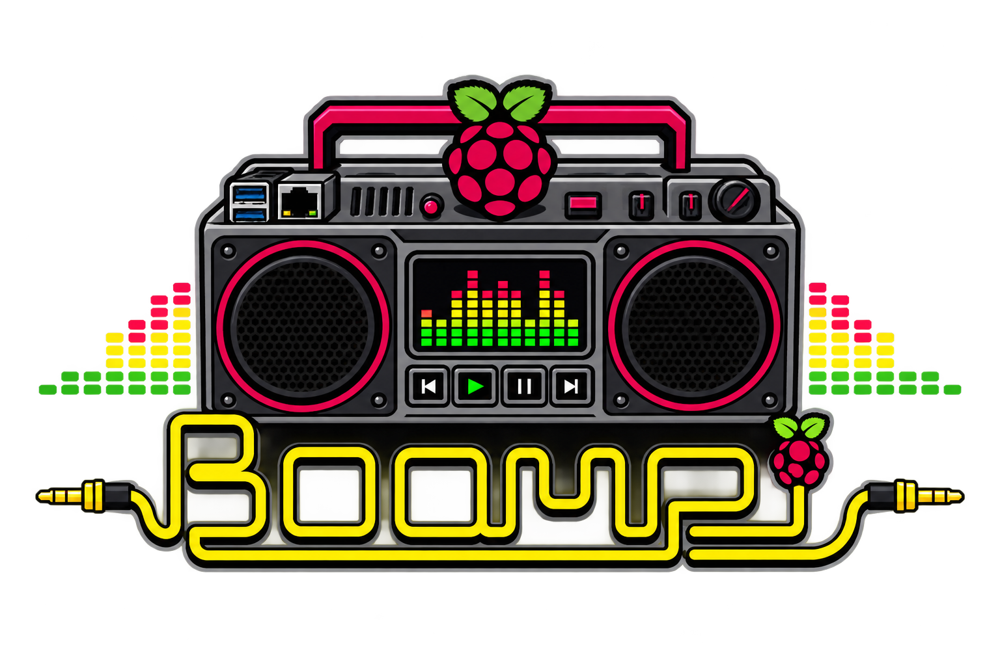

<p align="center">
  
</p>

# Boompi

Boompi turns a Raspberry Pi into a boombox: a complete, flashable
appliance OS for building your own - Bluetooth/AirPlay/Spotify audio,
a touchscreen now-playing UI, game emulation, battery awareness, and
remote control over Wi-Fi or BLE (web + iOS). It grew out of two
custom builds and is becoming something anyone can put in a box:

- **`boompid`** - Rust backend daemon: Bluetooth (BlueZ), Spotify Connect
  (librespot), AirPlay (shairport-sync), PipeWire volume, INA260 battery
  telemetry, FFT visualizer, album art. Serves a WebSocket/HTTP API.
- **`boompi-ui`** - Slint touchscreen UI: renders directly on DRM/KMS on the
  boombox, or as a desktop app on a laptop for development.
- **`web/`** - settings web app served by the box; **`web-remote/`** - the
  hosted Web Bluetooth remote ([boompi.n8.io](https://boompi.n8.io));
  **`ios/`** - the native iOS app.
- **`buildroot/`** - flashable, pre-configured SD card images (silent boot,
  A/B self-updates, first-boot setup). Box-specific hardware (display
  panel, DAC, battery sensor, wiring) is described by an on-device
  profile, not baked into the image - one image boots every build.

- **`boompid`** - Rust backend daemon: Bluetooth (BlueZ), Spotify Connect
  (librespot), AirPlay (shairport-sync), PipeWire volume, INA260 battery
  telemetry, FFT visualizer, album art. Serves a WebSocket/HTTP API.
- **`boompi-ui`** - Slint touchscreen UI: renders directly on DRM/KMS on the
  boombox, or as a desktop app on a laptop for development.
- **`buildroot/`** - flashable, pre-configured SD card images (silent boot,
  A/B self-updates, first-boot setup).

The v1 stack (Node.js + Next.js + Chromium kiosk) lives on the `v1` branch.
The (shipped) design and phased plan is in [`docs/PLAN.md`](docs/PLAN.md),
the A/B update system in [`docs/UPDATES.md`](docs/UPDATES.md), and
future work in [`docs/ROADMAP.md`](docs/ROADMAP.md).

Releases are cut with [changesets](.changeset/README.md): merging the
"Version Packages" PR publishes a GitHub Release with flashable images
and OTA assets; every green build of `main` also refreshes the rolling
`edge` prerelease. The boxes update themselves from either channel
(Settings → Software).

## Development

No hardware needed for UI work:

```sh
make sim   # terminal 1: backend with simulated sources/battery/visualizer
make ui    # terminal 2: the UI, connected to the local sim
```

Against a real boombox:

```sh
make ui BACKEND=ws://boombox.local:3001/ws
```

Other targets: `make check`, `make test`, `make fmt`, `make clippy`.
